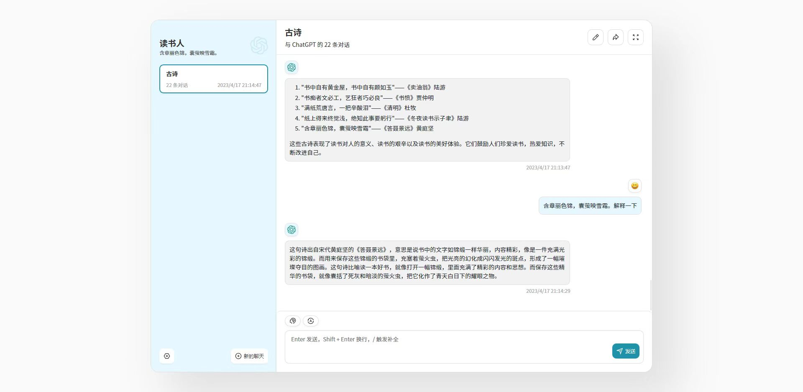

[私人ChatGPT，点我进入](https://dushuren.top/)
 

## 主要功能
- 精心设计的 UI，响应式设计，支持深色模式
- 极快的首屏加载速度（~100kb）
- 海量的内置 prompt 列表，来自[中文](https://github.com/PlexPt/awesome-chatgpt-prompts-zh)和[英文](https://github.com/f/awesome-chatgpt-prompts)
- 自动压缩上下文聊天记录，在节省 Token 的同时支持超长对话
- 一键导出聊天记录，完整的 Markdown 支持

## 开始使用
1. 获取 [OpenAI API Key](https://platform.openai.com/account/api-keys)，直接使用;
2. 没有自己的key可以联系作者获取访问秘钥；

## 联系我获取访问秘钥

## 打赏

